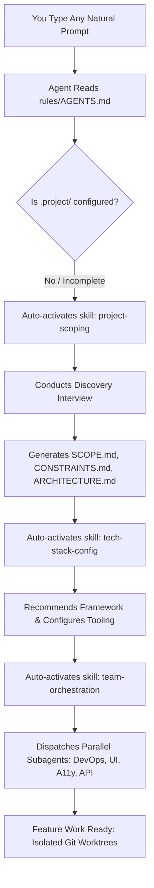

# Universal Frontend Development Harness (Antigravity Plugin)

A universal, shareable **Antigravity Plugin** and development harness for modern frontend projects. Designed to be included across multiple frontend repositories as a **Git Submodule**, providing battle-tested agent workflows, project scoping, constraints management, framework scaffolding, git worktree isolation, and CI/CD pipelines with GitHub and Netlify MCPs.

- **GitHub Repository**: [https://github.com/swoods-co/gemini-dev-harness](https://github.com/swoods-co/gemini-dev-harness)

---

## Architecture Overview

```text
├── plugin.json                 # Antigravity plugin manifest
├── mcp_config.json             # GitHub & Netlify MCP server configurations
├── rules/
│   └── AGENTS.md               # Harness workspace rules (worktree rules, CI/CD, subagents)
├── skills/
│   ├── init-frontend-harness/  # Zero-command agent bootstrap via git submodule
│   ├── project-scoping/        # Inception, user journeys, constraints & acceptance criteria
│   ├── backend-contract-sync/  # Ingests Go structs, OpenAPI, & SQL schemas from backend repos
│   ├── tech-stack-config/      # Framework selection, scaffolding, strict TS, linting & tests
│   ├── team-orchestration/     # Parallel subagent team dispatch (UI, DevOps, A11y, API)
│   ├── worktree-workflow/      # Safe parallel agent development in isolated .worktrees/
│   └── ci-cd-deployment/       # GitHub Actions CI & Netlify deploy previews via MCP
├── templates/                  # Ready-to-use blueprints injected into host projects
│   ├── project-root/           # AGENTS.md (living rules for future agent runs in the host repo)
│   ├── project-spec/           # SCOPE.md, CONSTRAINTS.md, TECH_STACK.md, ARCHITECTURE.md, DEPLOYMENT.md
│   │   ├── features/           # FEATURE_TEMPLATE.md (granular feature specifications)
│   │   └── contracts/          # README.md & canonical backend schema storage
│   ├── github/                 # pull_request_template.md (contract & verification checklist)
│   ├── github-actions/         # ci.yml, preview.yml
│   └── netlify/                # netlify.toml with security headers & caching
├── scripts/
│   ├── install-global-skill.ps1 # One-line global installer for Windows
│   ├── install-global-skill.sh  # One-line global installer for Linux / macOS
│   ├── install-harness.ps1     # PowerShell installer for host repos
│   └── install-harness.sh      # POSIX installer for host repos
└── README.md
```

---

## Clean Separation of Concerns & Living Project Rules

To allow this harness to be shared seamlessly across dozens of different projects:

| Layer | Responsibility | Location |
| :--- | :--- | :--- |
| **The Harness (Plugin)** | Universal workflows, agent rules, worktree isolation, CI/CD standards, GitHub & Netlify MCP tools. | `.agents/plugins/frontend-harness/` (Git Submodule) |
| **The Host Project Rules** | Living guidelines for future AI agents working on PRs and features after initial harness bootstrap. | `AGENTS.md` in host repository root |
| **The Host Project Contract** | Business domain, requirements, feature scope, framework decisions, and environment secrets. | `.project/` in host repository root |
| **The Feature Specifications** | Granular user stories, Gherkin acceptance criteria, and mock requirements for each feature. | `.project/features/` in host repository root |

### The Host Project Contract (`.project/` & Root `AGENTS.md`)
When Antigravity or any agent operates in a project equipped with this harness:
- **`AGENTS.md` (Project Root)**: Instructs future agents on component boundaries (`src/components/ui/` vs `src/components/domain/`), contract-first mock data discipline (`src/services/mock/` with `VITE_USE_MOCKS=true`), and mandatory verification gates before opening PRs.
- **`.project/SCOPE.md`**: Living roadmap, core user journeys, and milestone boundaries.
- **`.project/CONSTRAINTS.md`**: Performance budgets (LCP < 2.5s, INP < 200ms), accessibility (WCAG 2.1 AA), browser support, bundle size limits.
- **`.project/TECH_STACK.md`**: Confirmed frameworks, package managers, testing suites, folder architecture.
- **`.project/DEPLOYMENT.md`**: Netlify site ID, domains, secrets inventory.
- **`.project/features/`**: Feature-level spec files created from `FEATURE_TEMPLATE.md` to guide agents through discrete milestones.
- **`.github/pull_request_template.md`**: Automated GitHub PR checklist enforcing contract validation, tests, and Netlify preview links.

---

## Quickstart: Adding to Any Frontend Repository

### Option A: Pure Prompt-Driven Setup (Zero Terminal Commands)

Install the global bootstrap skill once on your machine:

**Windows PowerShell:**
```powershell
irm https://raw.githubusercontent.com/swoods-co/gemini-dev-harness/main/scripts/install-global-skill.ps1 | iex
```

**Linux / macOS:**
```bash
curl -fsSL https://raw.githubusercontent.com/swoods-co/gemini-dev-harness/main/scripts/install-global-skill.sh | bash
```

*(Or install the entire harness globally: `agy plugin install swoods-co/gemini-dev-harness`)*

**Then, in ANY new project:**
1. Open an empty folder in Antigravity.
2. Type in chat:
   > *"Set up this project with my frontend harness."*
3. The agent executes `git init`, links the submodule, scaffolds `.project/`, and starts the scoping interview automatically!

---

### Option B: Using the Local Installer Script

In your host repository root:

**Windows PowerShell:**
```powershell
git init -b main
.\.agents\plugins\frontend-harness\scripts\install-harness.ps1 -SubmoduleUrl "https://github.com/swoods-co/gemini-dev-harness.git"
```

**Linux / macOS:**
```bash
git init -b main
./.agents\plugins\frontend-harness\scripts\install-harness.sh "https://github.com/swoods-co/gemini-dev-harness.git"
```

---

### Option C: Manual Git Submodule Setup

1. Add the harness submodule inside `.agents/plugins/frontend-harness`:
   ```bash
   git submodule add https://github.com/swoods-co/gemini-dev-harness.git .agents/plugins/frontend-harness
   git submodule update --init --recursive
   ```

2. Initialize `.project/` by copying the spec templates:
   ```bash
   mkdir -p .project
   cp .agents/plugins/frontend-harness/templates/project-spec/*.md .project/
   ```

3. Ensure `.worktrees/` is added to your project's `.gitignore`:
   ```bash
   echo ".worktrees/" >> .gitignore
   ```

4. Commit the new submodule and `.project/` scaffolding:
   ```bash
   git add .gitmodules .agents/plugins/frontend-harness .project .gitignore
   git commit -m "chore: attach universal frontend dev harness plugin"
   ```

---

## How the Agent Works: Progressive Disclosure & Skill Activation

### Do I have to manually trigger skills?
**No.** You do **not** need to remember skill names or manually call them.

Antigravity operates on **Progressive Disclosure**:
1. When Antigravity opens your repository, it automatically reads `rules/AGENTS.md` and indexes the descriptions of all bundled skills.
2. When you start with **any natural prompt** (e.g. *"Let's build a real-time analytics dashboard"* or *"Help me start this new project"*), the agent reads `rules/AGENTS.md`.
3. The rule mandates that if `.project/` is uninitialized or missing requirements, the agent must **automatically activate `project-scoping`**.
4. The agent dynamically loads the full scoping skill, asks discovery questions, and populates `.project/`.
5. Once scoping is complete, it transitions automatically into `tech-stack-config` to bootstrap the code, and `ci-cd-deployment` to configure Netlify and GitHub Actions.

---

## The New Project Journey: Step-by-Step



### 1. The Scoping Interview (`project-scoping`)
The agent asks targeted discovery questions:
- **Core User Journeys**: What 2-3 workflows are MVP blockers?
- **User Personas & Devices**: Who uses it daily, and on what devices?
- **Hard Constraints**: Core Web Vitals (LCP < 2.5s), WCAG 2.1 AA accessibility, browser support.
- **Backend Repositories**: Do Go/Postgres backend models, routes, or OpenAPI specs already exist?
- **Explicit Non-Goals**: What is deferred or out of scope?

### 2. Backend Contract Ingestion (`backend-contract-sync`)
If you have an existing backend repository:
- The agent inspects the backend via **GitHub MCP** (zero Docker, zero clone) or local path.
- Automatically parses Go structs, JSON tags, router definitions (Gin/Chi/Echo/Fiber), or OpenAPI specs.
- Saves canonical contracts into `.project/contracts/`.
- Generates strict TypeScript types into `src/types/api.generated.ts` and configures `npm run codegen:api`.
- Generates typed mock handlers in `src/services/mock/` so you can build and test immediately.

### 3. Specification Generation
The agent writes testable Given-When-Then (Gherkin) acceptance criteria into `.project/SCOPE.md` and records performance limits in `.project/CONSTRAINTS.md`.

### 4. Tech Stack Bootstrapping (`tech-stack-config`)
The agent selects and configures:
- **Framework**: Vite + React / Next.js / Astro based on your SEO and interactivity requirements.
- **Styling**: Tailwind CSS v4 with design tokens.
- **Hygiene & Strictness**: Strict TypeScript (`strict: true`), ESLint/Biome, and Vitest suite.
- **Documentation**: Records all decisions in `.project/TECH_STACK.md`.

### 4. Parallel Subagent Delegation (`team-orchestration`)
The Lead Agent invokes specialized subagents in parallel with `Workspace: "branch"`:
- **DevOps & Pipeline Specialist**: Configures `netlify.toml`, `.github/workflows/ci.yml`, and preview checks.
- **UI/UX & Design System Specialist**: Scaffolds Tailwind tokens, theme toggle, and foundational UI primitives in `src/components/ui/`.
- **Accessibility & CWV Specialist**: Enforces landmark structures, skip links, and `axe-core` test setup.
- **API & Security Specialist**: Builds resilient fetch client, Zod schemas, and data caching providers.

### 5. Isolated Worktrees (`worktree-workflow`)
For subsequent feature development, the agent executes inside isolated git worktrees (`.worktrees/feat-<name>`), verifies builds and tests, pushes branches, and opens PRs using the **GitHub MCP**.

---

## Bundled Skills Reference

| Skill | Trigger / When it Activates | Deliverables |
| :--- | :--- | :--- |
| **`init-frontend-harness`** | Zero-command project bootstrap ("set up harness", "bootstrap project"). | `git init`, submodule add, `.project/` scaffolding, `.gitignore` |
| **`project-scoping`** | New project initialization, missing `.project/`, refining requirements. | `.project/SCOPE.md`, `.project/CONSTRAINTS.md`, `.project/ARCHITECTURE.md` |
| **`backend-contract-sync`** | Connecting to backend repo, importing Go/SQL schemas, or OpenAPI specs. | Ingested `.project/contracts/`, `src/types/api.generated.ts`, typed MSW mock handlers |
| **`tech-stack-config`** | Post-scoping, configuring framework, styling, testing, or linting. | Scaffolding, `tsconfig.json`, `package.json`, `.project/TECH_STACK.md` |
| **`team-orchestration`** | Post-scoping foundation kickoff, parallel multi-agent milestone dispatch. | Concurrently runs DevOps, UI/UX, A11y, and API subagents in isolated branches |
| **`worktree-workflow`** | Feature additions, bug fixes, parallel agent tasks. | Isolated `.worktrees/<branch>`, safe merge & cleanup |
| **`ci-cd-deployment`** | Pipeline setup, Netlify preview verification, build troubleshooting. | `netlify.toml`, `.github/workflows/ci.yml`, `.project/DEPLOYMENT.md` |

---

## MCP Integrations (`mcp_config.json`)

The plugin bundles configurations for two core MCP servers:

1. **GitHub MCP Server (`github-mcp-server`)**:
   - Manages branches, creates pull requests, inspects commits, and queries CI status checks.
   - Requires: `GITHUB_PERSONAL_ACCESS_TOKEN` environment variable.

2. **Netlify MCP Server (`netlify`)**:
   - Inspects sites, queries deployment statuses, retrieves deploy preview URLs, and reviews build logs.
   - Requires: `NETLIFY_PERSONAL_ACCESS_TOKEN` environment variable.

---

## Updating the Harness in Downstream Projects

To pull the latest harness skills, rules, and templates in any downstream project:
```bash
git submodule update --remote .agents/plugins/frontend-harness
git commit -am "chore: update frontend dev harness plugin"
```
