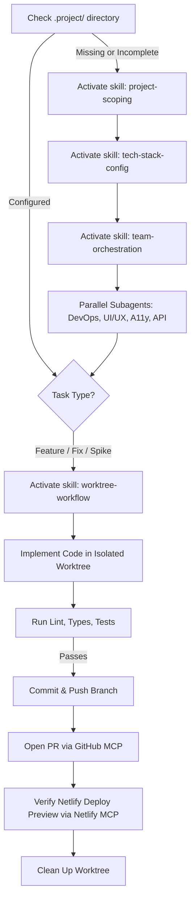

# Universal Frontend Development Harness — Workspace Rules

Welcome to the Universal Frontend Development Harness. When this plugin is active, all agents operating in this workspace must strictly abide by the rules, contracts, and engineering disciplines described below.

---

## 1. Boundary & Contract: Universal Harness vs. Project Specifics

To ensure universal portability across any frontend project, this harness maintains a strict separation of concerns:

- **The Harness (Plugin)** governs:
  - Agent workflows, runbooks, and behavior.
  - Git worktree lifecycle and isolation rules.
  - CI/CD pipeline automation and deployment standards (GitHub Actions, Netlify).
  - MCP tool integrations (GitHub MCP, Netlify MCP).
  - High-standard code hygiene, testing, and accessibility baselines.

- **The Host Project (Repository)** governs:
  - Business domain, product requirements, and scope.
  - Specific framework & library selections (Next.js, Vite, React, Vue, Svelte, Tailwind, etc.).
  - Environmental configurations, branding, and domain constraints.

### The Host Project Contract (`.project/`)
The agent must treat the `.project/` directory in the repository root as the single source of truth for project-specific decisions:
- `.project/SCOPE.md`: Functional scope, milestones, user stories, out-of-scope boundaries.
- `.project/CONSTRAINTS.md`: Hard performance budgets (CWV, LCP, INP), accessibility standards (WCAG 2.1 AA), browser matrix, bundle size limits.
- `.project/TECH_STACK.md`: Confirmed frameworks, package managers, styling engines, test suites, and folder architecture.
- `.project/DEPLOYMENT.md`: Netlify site identifiers, environments, secrets manifest, custom domain routing.

> [!IMPORTANT]
> Whenever an agent is assigned a task in a project using this harness:
> 1. Check if `.project/` exists.
> 2. If `.project/` is missing or incomplete, activate the `project-scoping` skill to guide the user through initialization.
> 3. Never invent or assume tech stacks or business constraints that contradict `.project/`.

---

## 2. Git Worktree & Branching Disciplines

To avoid dirtying the primary working tree, breaking concurrent workflows, or generating unisolated state:

1. **Clean Root Tree**:
   - The primary working directory should remain on `main` or the default integration branch, clean and tracking remote.
   - Never implement features, heavy refactors, or risky spikes directly on the primary working tree.

2. **Isolated Worktrees for Tasks**:
   - For all multi-step features, bug fixes, or exploration, create an isolated worktree under `.worktrees/`:
     ```bash
     git worktree add .worktrees/<branch-name> -b <branch-name>
     ```
   - Standard branch naming conventions:
     - `feat/<short-description>`: New features or user stories.
     - `fix/<short-description>`: Bug fixes and regressions.
     - `chore/<short-description>`: Dependency updates, CI adjustments.
     - `spike/<short-description>`: Rapid architectural exploration.

3. **Dependency Discipline in Worktrees**:
   - Ensure the worktree has its dependencies installed or shared before running builds or tests (`pnpm install`, `npm install`, or worktree dependency link scripts).

4. **Verification & Clean Removal**:
   - Before completing a task, run lint, type-check, and tests within the worktree.
   - After merging or opening a pull request, remove the worktree:
     ```bash
     git worktree remove .worktrees/<branch-name>
     ```

---

## 3. Tooling & MCP Integration Disciplines

### GitHub MCP Integration
- Use GitHub MCP tools for repository queries, PR creation, review inspection, and issue tracking.
- Branch protection: PRs must be opened against `main` with detailed descriptions linking to relevant scoping items in `.project/SCOPE.md`.
- PR summaries must include: Summary of changes, testing performed, screenshot/preview links, and risk assessment.

### Netlify MCP Integration
- Use Netlify MCP tools for deploy previews, site status, build logs, and environment variable audits.
- Every pull request should have an associated Netlify Deploy Preview verified before merging.
- If a build fails in CI or Netlify, query the Netlify MCP logs to diagnose the exact failure point.

---

## 4. Code Quality & Modern Frontend Standards

- **TypeScript**: Strict mode enabled. No arbitrary `any` types; prefer explicit domain models.
- **Accessibility**: All interactive elements must adhere to WCAG 2.1 AA (accessible tap targets, proper ARIA attributes, semantic HTML, keyboard navigable).
- **Core Web Vitals**:
  - Keep LCP (Largest Contentful Paint) < 2.5s.
  - Keep INP (Interaction to Next Paint) < 200ms.
  - Keep CLS (Cumulative Layout Shift) < 0.1.
- **Testing**:
  - Unit/Component tests for critical user paths and UI components.
  - End-to-end sanity tests before production release.

---

## 5. Agent Workflow Sequence

When beginning any project or feature:


### 5.2 Parallel Subagent Delegation (`team-orchestration`)
To eliminate bottlenecks and prevent sequential delays, once the project is scoped and base framework scaffolded:
- **Lead Agent** should invoke specialized subagents in parallel with `Workspace: "branch"`:
  1. **DevOps & Pipeline Specialist**: Configures Netlify, GitHub Actions CI, and environment variables.
  2. **UI/UX & Design System Specialist**: Sets up Tailwind tokens, base layout, and reusable UI primitives.
  3. **Accessibility & CWV Specialist**: Configures keyboard traps, semantic landmarks, and a11y testing.
  4. **API & Data Specialist**: Sets up resilient HTTP clients, cache providers, and Zod schemas.
- Each subagent executes in an isolated branch worktree, reports progress back asynchronously, and opens PRs via GitHub MCP without blocking one another.
