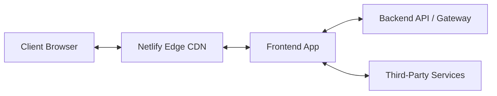

# System Architecture & Technical Design

## 1. System Overview
High-level overview of the application flow, data pipeline, and system boundaries.

---

## 2. Component Hierarchy & Data Flow
- **Data Fetching Pattern**:
  - Initial load data caching and prefetching.
  - Client-side updates, optimistic mutations, and cache invalidation strategies.
- **State Boundaries**:
  - Global vs. local state separation.
  - URL as state (filter parameters, search queries, pagination state stored in query params).

---

## 3. Error Handling & Resilience
- **Error Boundaries**: Root-level and route-level error boundaries with user-friendly fallback screens.
- **Network Resilience**: Exponential backoff retry on transient API network errors.
- **Monitoring & Observability**: [e.g., Sentry / Datadog / OpenTelemetry] integration points.

---

## 4. Key Architectural Decisions (ADRs)
| Decision ID | Title | Status | Rationale | Alternatives Considered |
| :--- | :--- | :--- | :--- | :--- |
| ADR-001 | [e.g., Tailwind CSS over CSS-in-JS] | Accepted | Zero runtime overhead, design token consistency | Styled-components, Emotion |
| ADR-002 | [e.g., TanStack Query for remote state] | Accepted | Standardized cache invalidation and loading states | Redux Toolkit |
